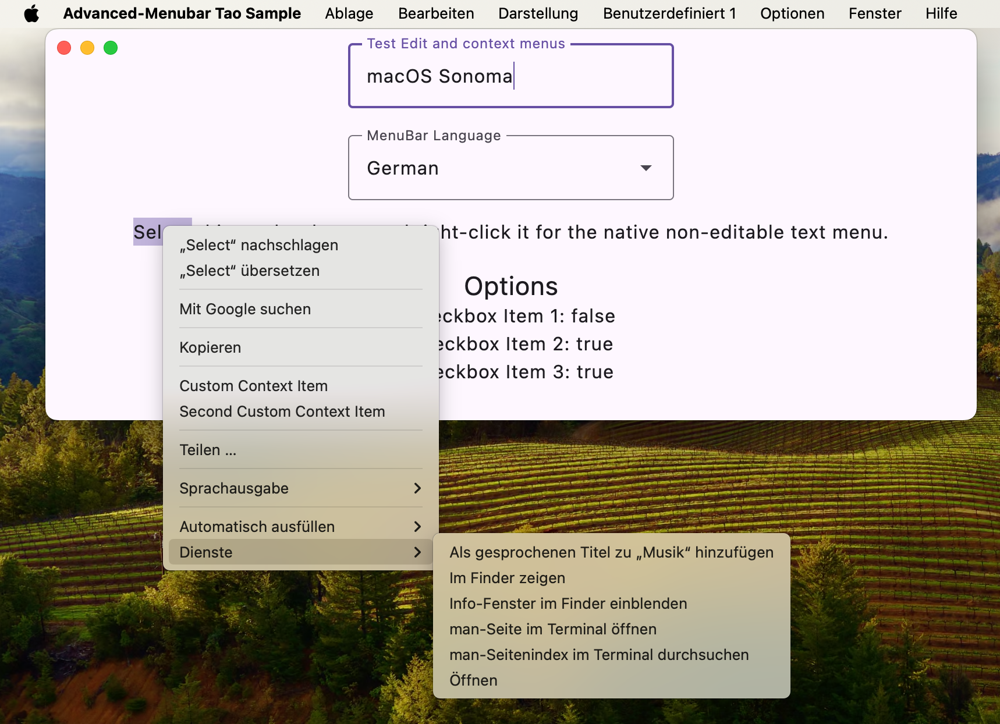

# Advanced Menubar

Advanced Menubar adds declarative, native macOS menus to Compose Desktop. Its Kotlin DSL supports
standard application and document commands, dynamic custom menus, Compose text editing, Services,
the Window menu, native context menus, localized labels, icons, shortcuts, checkmarks, subtitles,
tooltips, and badges.

Two window backends are available:

- `advanced-menubar-awt` integrates with Compose Desktop `Window` and can render the same DSL as
  Swing on Windows and Linux.
- `advanced-menubar-tao` integrates with Tao decorated windows without initializing AWT. Tao is
  provided by the [Nucleus library](https://github.com/NucleusFramework/Nucleus).




## Installation

Replace `current-version` with the current published release:

```kotlin
dependencies {
    implementation("dev.hansholz:advanced-menubar-awt:current-version")
}
```

For a Nucleus Tao window:

```kotlin
dependencies {
    implementation("dev.hansholz:advanced-menubar-tao:current-version")
}
```

The artifacts target JVM 21. Native macOS libraries for Apple Silicon and Intel are packaged in the
published artifacts.

## Quick start

```kotlin
Window(
    title = "Notes",
    onCloseRequest = ::exitApplication,
) {
    DefaultMacMenuBar(
        onAboutClick = { showAbout = true },
        onSettingsClick = { showSettings = true },
        onHelpClick = ::openHelp,
    )

    NotesScreen()
}
```

For full control, declare the native menu structure yourself:

```kotlin
AdvancedMacMenuBar(appName = "Notes") {
    MacApplicationMenu {
        About { showAbout = true }
        Separator()
        Services()
        Separator()
        Hide()
        HideOthers()
        ShowAll()
        Separator()
        Quit()
    }

    FileMenu {
        FileNew { newDocument() }
        FileOpen { openDocument() }
        Separator()
        Item(
            title = "Export",
            shortcut = MenuShortcut(Key.E, meta = true, shift = true),
        ) { exportDocument() }
    }

    CustomMenu("View") {
        Checkbox("Sidebar", checked = sidebarVisible) { sidebarVisible = it }
    }
}
```

On Windows and Linux, `CompatibilityMenuBar` renders the DSL as a Swing menu and uses customary
accelerators such as Ctrl+Z, Ctrl+Y, F3, F11, and F1. Native macOS menu functions never silently
fall back to Swing. AppKit-only presentation (SF Symbols, subtitles, and badges) is intentionally
omitted by Swing.

## Native text context menus

```kotlin
NativeTextContextMenuProvider(
    isDark = darkTheme,
    customActions = listOf(
        ContextMenuAction("Look up in project", "magnifyingglass") {
            lookUpSelection()
        },
    ),
) {
    Column {
        OutlinedTextField(state = textState)
        SelectionContainer {
            Text("Selectable, read-only text")
        }
    }
}
```

On macOS, `isDark` changes the appearance of the entire `NSApplication` so all native menus use the
same theme. Editable fields and selectable read-only text receive their corresponding native AppKit
menus. If the native bridge is unavailable, Compose's normal context menu remains active.

## Documentation

The [project documentation](https://hansholz09.github.io/Advanced-MenuBar/) covers backend selection, every DSL group, native Edit
behavior, context menus, icons, shortcuts, localization, GraalVM packaging, limitations, and sample
applications. Start with the [Quickstart](https://hansholz09.github.io/Advanced-MenuBar/quickstart/) or open the
[DSL reference](https://hansholz09.github.io/Advanced-MenuBar/api-reference/).

## License

Advanced Menubar is available under the [Apache License 2.0](LICENSE.txt).
