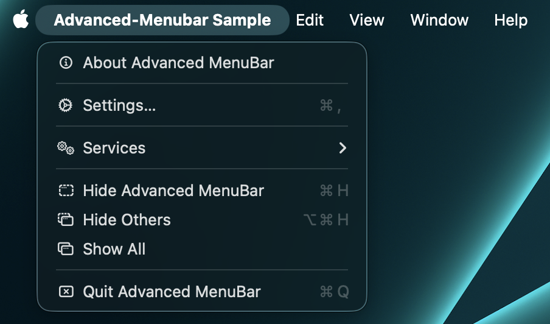

# Default macOS menu

`DefaultMacMenuBar` is the shortest route to a useful Mac application menu. It includes:

- application menu: About, optional Settings, Services, Hide, Hide Others, Show All, Quit;
- Edit: Undo, Redo, Cut, Copy, Paste, Delete, Select All;
- View: state-aware Enter/Exit Full Screen;
- Window: Minimize, Zoom, Bring All to Front;
- optional Help callback.

```kotlin
DefaultMacMenuBar(
    appName = "Notes",
    onAboutClick = { aboutVisible = true },
    onSettingsClick = { settingsVisible = true },
    onHelpClick = ::openHelp,
    editMenu = true,
    viewMenu = true,
    windowMenu = true,
    helpMenu = true,
)
```

When `onAboutClick` is absent, AppKit opens its standard About panel. Settings is included only when
a callback exists. macOS may extend Edit with system-provided Writing Tools, AutoFill, Dictation,
and Emoji & Symbols. Availability and presentation are controlled by the running operating system.

For a different structure, copy the small declaration into `AdvancedMacMenuBar` and customize it.


