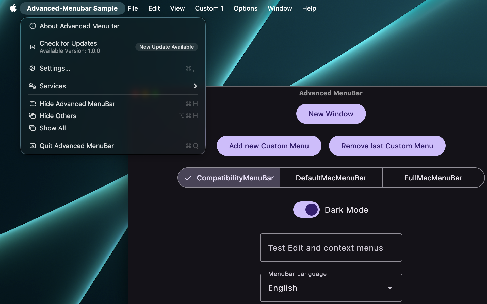

# Native menus for Compose Desktop

Advanced Menubar lets Compose applications use real AppKit menus while keeping menu definitions and
state in Kotlin. It handles process-wide menu ownership, standard macOS actions, Compose edit
commands, localization, and native text popups.

## What it covers

- a ready-to-use conventional macOS menu with `DefaultMacMenuBar`;
- a declarative DSL for application, File, Edit, Format, View, Window, Help, and custom menus;
- submenus, sections, separators, actions, checkboxes, enabled state, and live Compose state;
- AppKit Services, automatic window lists, Writing Tools, AutoFill, Dictation, and Emoji & Symbols;
- native and custom shortcuts, SF Symbols, PNG/file/vector icons, tooltips, subtitles, and badges;
- native context menus for Compose text fields;
- multiple AWT or Tao windows with focus-aware menu ownership;
- a Swing renderer for Windows and Linux;
- packaged JNI metadata and libraries for GraalVM Native Image.

## Choose a backend

| Backend | Window scope | Platforms | Behavior |
| --- | --- | --- | --- |
| AWT native | `FrameWindowScope` | macOS | Real AppKit main menu |
| AWT compatibility | `FrameWindowScope` | macOS, Windows, Linux | AppKit on macOS; Swing elsewhere |
| Tao | `TaoDecoratedWindowScope` | macOS | AppKit without AWT |

Tao is part of the [Nucleus library](https://github.com/NucleusFramework/Nucleus). Native macOS
entry points remain native and do not use Swing as a loading-error fallback.

[Start with the Quickstart](quickstart.md) or browse the [complete DSL reference](api-reference.md).
