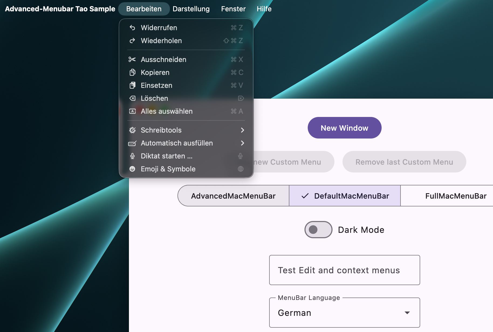

# Tao on macOS

The Tao backend integrates with `TaoDecoratedWindowScope` and does not initialize AWT. Tao is the
window/event-loop backend from the [Nucleus library](https://github.com/NucleusFramework/Nucleus).

```kotlin
taoApplication {
    DecoratedWindow(onCloseRequest = ::exitApplication, title = "Notes") {
        AdvancedMacMenuBar(appName = "Notes") {
            MacApplicationMenu {
                About { showAbout = true }
                Separator()
                Services()
                Separator()
                Quit()
            }
            EditMenu {
                Undo()
                Redo()
                Separator()
                Cut()
                Copy()
                Paste()
                SelectAll()
            }
            WindowMenu {
                Minimize()
                Zoom()
                Separator()
                BringAllToFront()
            }
        }
        NotesScreen()
    }
}
```

Menu ownership follows `state.isActive`, and `DefaultMacMenuBar` reads fullscreen state directly
from the Tao scope. There is no Swing renderer or AWT recovery path in this backend.


