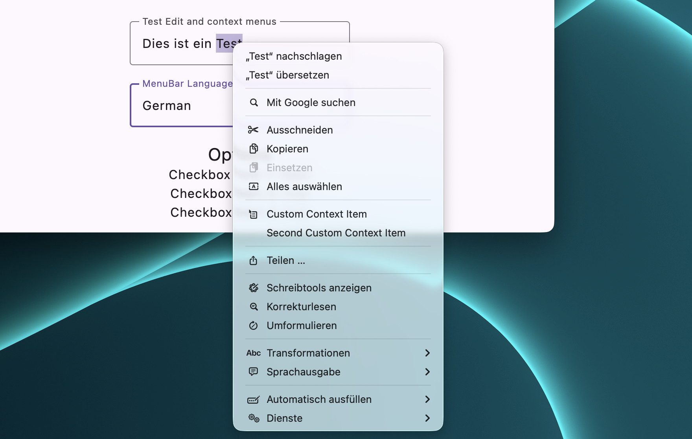

# Text context menus

`NativeTextContextMenuProvider` replaces Compose text popups below it with AppKit's native text
context menu on macOS:

```kotlin
NativeTextContextMenuProvider(
    isDark = darkTheme,
    showExtraOptions = true,
    customActions = listOf(
        ContextMenuAction("Look up in project", "magnifyingglass") { lookUp() },
    ),
) {
    DefaultMacMenuBar()

    Column {
        OutlinedTextField(state = textState)
        SelectionContainer {
            Text("This text can be selected, but not edited.")
        }
    }
}
```

## Default Edit menu state

A `DefaultMacMenuBar` declared inside the provider scope disables Undo, Redo, Cut, Copy, Paste,
Delete, and Select All when no editable Compose text field has an active platform text-input
session. All commands are enabled together when such a session starts. If the default menu is
outside the provider (or the provider is not used) the entries remain enabled as before. Custom
`AdvancedMacMenuBar` and `CompatibilityMenuBar` Edit declarations keep their explicit state.

## Editable text

AppKit creates the menu from an editable native text view and applies system transformations to the
current Compose selection. The transformed value is sent directly to Compose's text-state editing
path, avoiding the system pasteboard and preserving input transformations and undo behavior. A
guarded pasteboard path remains only as a compatibility fallback for an unknown Compose text-manager
implementation.

When no text is selected, the Transformations and Speech submenus are removed because neither can
act on a selection. Right-clicking a word first uses Compose's normal macOS selection behavior, so
those submenus remain available for the selected word.

`showExtraOptions = false` keeps a compact Cut/Copy/Paste menu plus Select All and custom actions.



## Selectable, non-editable text

Content such as `Text` inside a `SelectionContainer` is represented by a selectable,
non-editable AppKit text view. AppKit therefore builds its genuine read-only text menu instead of
offering editing commands that cannot be executed. Cut, Paste, and Select All are removed; Copy and
the applicable native lookup, translation, search, sharing, and speech actions remain available.

## Older macOS versions

The menu is generated by the AppKit version on which the application is running, so labels, icons,
services, and grouping can differ between macOS releases while behavior stays native.


## Appearance and fallback

`isDark` changes the appearance of the entire `NSApplication`; this is intentional so every native
menu follows the application theme. Pass `null` to keep the current AppKit appearance. When the JNI
bridge cannot load, Compose's original text context menu remains active.
